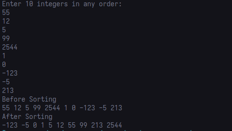

# HPC Лабораторные работы
Группа: O8-107М-22

Студенты: Скворцов И. Чистов В.

---
## Сортировка слияением (MergeSort)

Принцип работы сортировки слиянием понятен из диаграммы:


Концептуально описывается следующим образом:
- Поделить неотсортированный лист на n подлистов. каждый содержит 1 элемент.
- Итеративно соединять подлисты для создания новых отсортированных подлистов пока не останется лишь один подлист, который и будет конечным отсортированным листом.

---

На данный момент работает только однопоточный вариант.

Его вывод:



---

Файлы:
```
mergeSort_singlecore - однопоточная версия
mergeSort_multicore - версия с mpi
shell.nix - файл подготовки окружения на основе пакетного менеджера nix
```